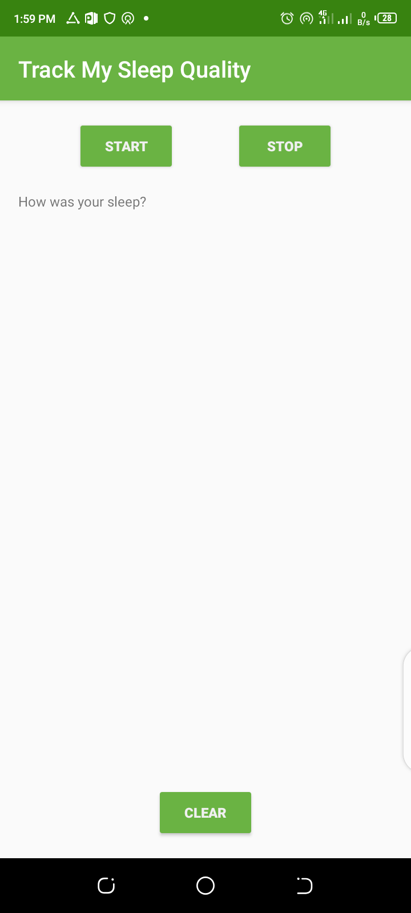

# Seep-Tracker
A clone of the sleep tracker application from Udacity Lessons

>> This is the toy app for lesson 6 of the
>> [Android App Development in Kotlin course][1] on Udacity
* The SleepQualityTracker app is a demo app that helps you collect information about your sleep.
    - Start time, end time, quality, and time slept
### Tech Stack and Utilities
* [Room database][2]
* [DAO] [3]
* [Coroutines][4]
* [Transformation map][5]
* [Data Binding][5] in XML files
* [ViewModel Factory][5]
* [Backing Properties ][5]- protects MutableLiveData
* [Observable state LiveData][5] variables to trigger navigation

[1]: https://www.udacity.com/course/???
[2]: https//www.source
[3]: https//www.source
[4]: https//www.source
[5]: https//www.source
### Screenshots
||
|:--:|